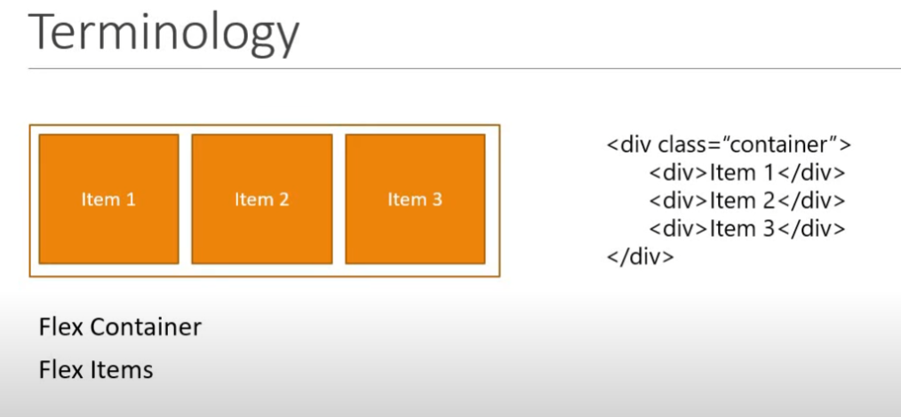
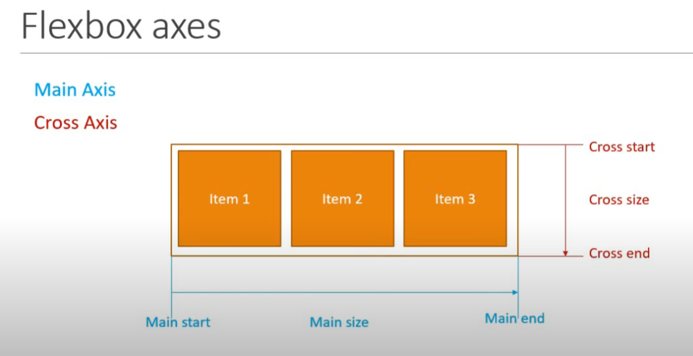
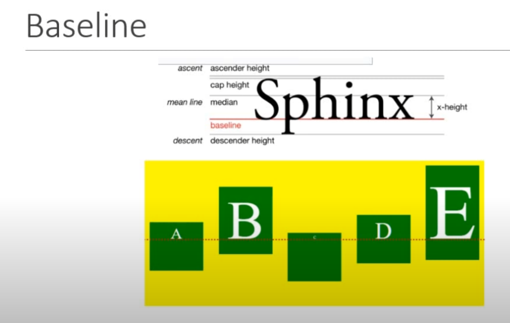

**Flexbox**
Definizione -> Modulo di lyout flessibile unidimensionale.
            Semplifica la progettazione di lyout complessi.

Esistevano 4 principali modalità di lyout (block, inline, table, positioned). Tuttavia erano rognose, applicare trucchi.

**Vantaggi di FlexBox**
- Permette di disporre gli elementi da sx a dx, alto in basso,...
- Consente un controllo preciso sulla spaziatura, allineare l'ordine degli  elemnti
- La presenza di Bootstrap 4 (poplare framework) 

---

**Terminiolgia**

**Flex container** -> il div principale che contiene gli elementi
**Flex items** -> Elementi figli del contenitore flex.

---

**Assi di Flexbox**

**Main Axis** -> Per impostazione predefinita l'asse principale va da dx (Main Start) a sx (Main End) (Main End - Main Start = Main Size).
**Cross Axis** -> Perpendicolare all'asse principale, va dall'alto (Cross Start) verso il basso (Cross End) (Cross End - Cross Start = Cross Size).

NOTA -> La direzione di entrambi gli assi può essere modificata.

---
**Proprietà del Flex Container**
- **display** -> Proprietà fondamentale obbligatoria per definire un Flex Container.
- **flex-direction** -> Definisce la direzione in cui gli elementi Flex vengono disposti all'interno del container
- **flex-wrap** -> Controlla il wrapping (avvolgimento) degli elementi all'interno del container. Se gli elementi superano lo spazio disponibile, questa proprietà decisde se debbano andare a caoi su una nuova riga o rimanere su una singola riga.
- **flex-flow** -> Proprietà abbreviata che combina flex-direction e flex-wrap.
- **justify-content** -> Definisce l'allineamento degli elementi lungo l'asse principale (main axis).
- **align-item** -> Defisce l'allineamento degli elementi Flex lungo l'asse trasversale (cross axis).
- **align-content** -> Proprietà simile a (justify-content), allinea lungo l'asse trasversale. Importante pk algin-content funziona solo quando ci sono più righe di elementi Flex nel container.

-------

**Baseline**
